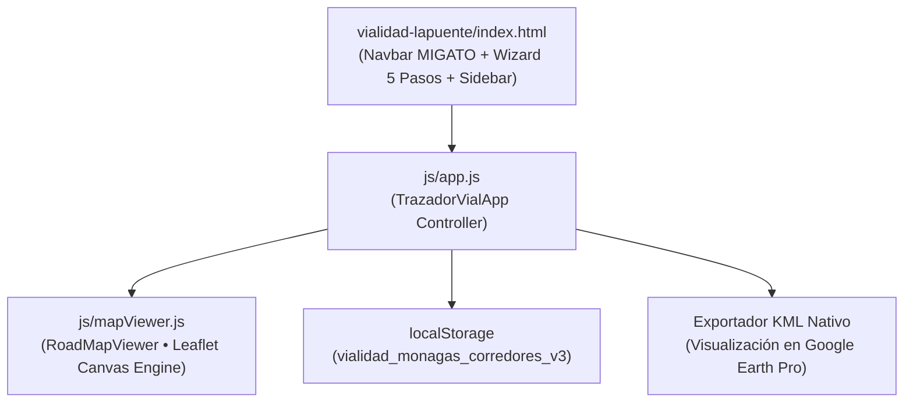

# Plan Técnico 001 — Módulo de Infraestructura y Diagnóstico Vial
**Spec de Referencia:** `.sdd/specs/001-infraestructura-vial/spec.md`  
**Arquitecto:** Ing. Diego Donado  
**Estado:** Completado / Producción  

---

## 1. Arquitectura Técnica del Sistema

El módulo se diseñó bajo una arquitectura modular y desacoplada en JavaScript moderno (ES Modules):



## 2. Decisiones Técnicas y Justificación

### Decisión 1: Motor Gráfico Canvas Nativo en lugar de SVG Estándar
- **Justificación:** Los navegadores móviles y desktop sufren desfases y deformaciones de líneas cuando se hacen zooms rápidos con decenas de polilíneas SVG. `L.canvas()` dibuja directamente en el búfer gráfico acelerado por GPU de la GPU del dispositivo.
- **Alternativa descartada:** SVG tradicional de Leaflet (descartada por saltos visuales y jitter en tablets de inspectores).

### Decisión 2: Formulario Asistido Progresivo (Wizard 5 Pasos)
- **Justificación:** La captura técnica de 10 jerarquías viales, múltiples canales, patologías dinámicas y puentes en una sola pantalla causaba una saturación cognitiva inaceptable. El flujo en 5 pasos permite un llenado limpio y focalizado.
- **Alternativa descartada:** Formulario plano masivo o acordeones colapsables complejos.

### Decisión 3: Erradicación de Progresivas "PK" por Formato Métrico Humano
- **Justificación:** El término de ingeniería civil `PK 0+329` creaba confusión al equipo directivo, arquitectos y movilizadores. El formateador `RoadMapViewer.formatPK(m)` fue refactorizado para retornar distancias legibles directas: `De 0 m a 329 m` o `1,85 km`.
- **Alternativa descartada:** Mantener el prefijo "PK" configurable (descartada para no dejar rastro de siglas confusas).

### Decisión 4: Botón de Borrado Inmediato de Vía en Tarjeta
- **Justificación:** El inspector necesita descartar trazos erróneos con un solo clic visible, en lugar de buscar iconos diminutos o menús contextuales.
- **Alternativa descartada:** Menú desplegable de tres puntos (descartada por lentitud en campo).

## 3. Modelo de Datos del Corredor Vial (`localStorage`)

```json
{
  "id": "CORR-1727550000000",
  "codigo": "CV-1",
  "nombre": "Troncal 10 (Maturín - Caripito)",
  "jerarquia": "Troncal / Autopista (T-10, T-13)",
  "longitudTotalM": 329,
  "subtramos": [
    {
      "id": "SUB-1727550000000-1",
      "nombre": "Tramo 1",
      "color": "verde",
      "longitudM": 329,
      "pkInicioM": 0,
      "pkFinM": 329,
      "puntos": [[9.7185, -63.2120], [9.7190, -63.2115]],
      "canalesAfectados": "ambos",
      "patologias": [],
      "obraArte": {
        "tiene": "no",
        "tipo": "puente_mayor",
        "nombre": "",
        "falla": "socavacion_pilas"
      },
      "puenteCritico": "ninguno",
      "drenaje": "intactos",
      "bombeoTecnico": "adecuado_2pct",
      "superficieAgricola": "arena_sabana",
      "detalle": "",
      "foto": null,
      "fecha": "2026-09-28T21:00:00.000Z"
    }
  ]
}
```

## 4. Archivos Modificados
- `vialidad-lapuente/index.html`: Header institucional MIGATO, Wizard de 5 pasos, tipografía de 16px/14px.
- `vialidad-lapuente/js/app.js`: Lógica del controlador, formateo de distancias sin PK, saneamiento de nombres y borrado directo.
- `vialidad-lapuente/js/mapViewer.js`: Visor Canvas, tooltips con rangos métricos legibles y marcadores iniciales sin PK.
