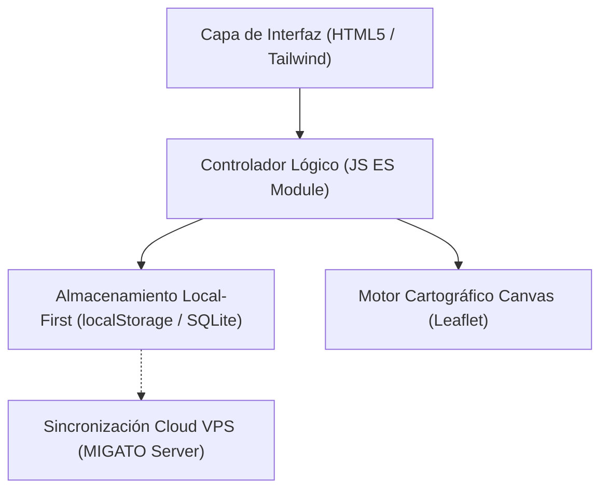

# Plan Técnico NNN — <Nombre de la Funcionalidad>
**Spec de Referencia:** `spec.md`  
**Arquitecto / Autor:** Ing. Diego Donado  
**Estado:** [Borrador | Aprobado | En Ejecución]  

---

## 1. Resumen de la Arquitectura
<Descripción técnica general de los componentes involucrados, librerías y capas.>

## 2. Diagrama de Flujo / Componentes

## 3. Modelo de Datos
<Estructura JSON o esquema de base de datos exacto, con tipos y valores por defecto.>

## 4. Decisiones Técnicas y Alternativas Descartadas
- **Decisión 1:** <Qué tecnología o enfoque se eligió y por qué>.
  - *Alternativa descartada:* <Qué otra opción se evaluó y por qué se rechazó>.
- **Decisión 2:** <Qué patrón de diseño se adoptó>.
  - *Alternativa descartada:* <Qué otra opción se evaluó>.

## 5. Archivos Afectados
- `[NUEVO]` `ruta/al/archivo.js`: <Propósito>.
- `[MODIFICADO]` `ruta/al/archivo.html`: <Propósito de las modificaciones>.

## 6. Plan de Verificación de Calidad
- Pruebas automáticas o comandos de consola para verificar integridad.
- Verificación visual en navegadores desktop y móviles.
