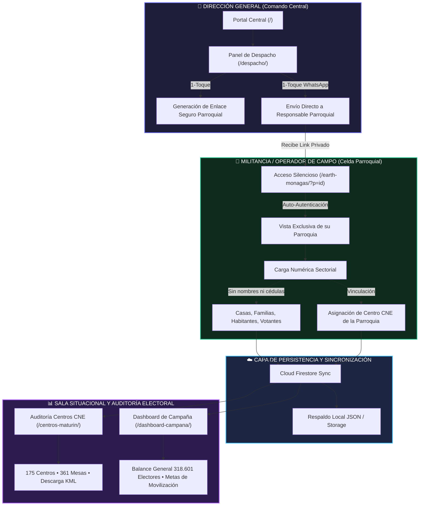

# DOCUMENTACIÓN TÉCNICA Y OPERATIVA: SUITE TERRITORIAL Y ELECTORAL MONAGAS 2026

> **CONFIDENCIAL • DIRECCIÓN GENERAL DE CAMPAÑA • ESTADO MONAGAS**  
> *Plataforma Cartográfica, Auditoría de Centros CNE y Despacho Táctico de Militancia*

---

## 1. INTRODUCCIÓN Y PRINCIPIO RECTOR

La presente suite de sistemas ha sido diseñada bajo un principio de **compartimentación celular y discreción táctica**. En un escenario de alta exigencia territorial y electoral, **los operadores de base nunca deben tener visibilidad de la estructura global** ni de los despliegues de otras parroquias o municipios, reduciendo riesgos de seguridad informática, fugas de información o confusión operativa.

### Pilares Fundamentales:
1. **Compartimentación Estricta:** Cada responsable de parroquia recibe un enlace directo y exclusivo. Al ingresar, el sistema no muestra menús desplegables con otras parroquias ni herramientas complejas innecesarias.
2. **Protección Absoluta de la Militancia:** Se prohíbe el registro de datos personales (cero nombres, cero cédulas, cero números de teléfono). Toda la carga es **estrictamente numérica sectorial** (casas, familias, habitantes, votantes estimados y escuela CNE asignada).
3. **Centralización en Dirección General:** Solo la Dirección General cuenta con la visión consolidada (13 Municipios, 44 Parroquias, 175 Centros y 361 Mesas Electorales).

---

## 2. DIAGRAMA DE FLUJO INTEGRAL DEL SISTEMA

---

## 3. DESGLOSE MODULAR DE LOS 5 SISTEMAS

### MÓDULO 0: PORTAL CENTRAL DE MANDO
- **Ruta Web:** `/` (`index.html`)
- **Propósito:** Puerta de acceso institucional y punto de distribución para el equipo directivo.
- **Características Clave:**
  - Resumen macro de Monagas (13 Municipios, 44 Parroquias).
  - Indicadores oficiales de Maturín: **318.601 electores**, **175 centros electorales**, **361 mesas**.
  - Tarjetas de enlace a los submódulos especializados.
  - Accesos directos para la Dirección General y accesos a despacho.

---

### MÓDULO 1: PANEL DE DESPACHO PRIVADO (DIRECCIÓN GENERAL)
- **Ruta Web:** `/despacho/`
- **Propósito:** Herramienta ágil y privada para que la Dirección General genere y distribuya los enlaces de carga a cada parroquia en cuestión de segundos.
- **Funcionalidades:**
  - **Detección Automática de Dominio:** Los enlaces se construyen adaptándose automáticamente a producción (`https://.../earth-monagas/?v=90&p=[id]`).
  - **Botón `📋 Copiar`:** Copia el enlace directo al portapapeles con 1 toque.
  - **Botón `📲 WhatsApp`:** Abre WhatsApp Web o la App móvil con el mensaje oficial pre-redactado listo para enviar al responsable de la parroquia.
  - **Botón `👁️ Probar`:** Abre la vista exacta que verá el operador parroquial para validar la experiencia.
  - **Filtro Rápido:** Alterna entre las 10 parroquias de Maturín o las 44 del Estado Monagas.
  - **Botón `Copiar Lista Completa`:** Exporta el listado consolidado para reportes de sala de mando.

---

### MÓDULO 2: CARTOGRAFÍA SATELITAL Y MILITANCIA (MIGATO EARTH)
- **Ruta Web:** `/earth-monagas/`
- **Propósito:** Georreferenciación 3D satelital de ejes territoriales y sectores vecinales.
- **Comportamiento por Rol (RBAC):**

#### A. Modo Militancia (Operador de Parroquia)
- **Activación:** Se accede mediante el link enviado desde el despacho (ej. `?p=las-cocuizas`, `?p=alto-de-los-godos`).
- **Seguridad y Discreción:**
  - El modal de login se autentica silenciosamente en segundo plano sin pedir usuario ni clave.
  - **No existe ningún selector ni lista desplegable con las otras 43 parroquias.**
  - Se oculta la barra de herramientas técnicas de dibujo (polígonos, rutas, marcadores avanzados).
  - Se abre automáticamente el panel de "Lugares" mostrando únicamente los sectores y ejes de su parroquia.
  - El operador solo se enfoca en completar los 5 campos numéricos sectoriales y vincular el centro de votación oficial.

#### B. Modo Dirección General (Administración Central)
- **Activación:** Se accede con credenciales master (`admin` / `admin` o `?u=admin`).
- **Capacidades:**
  - Control de los 13 Municipios y 44 Parroquias.
  - Herramientas SIG completas: trazado de polígonos, cálculo de áreas, ajuste de coordenadas.
  - Importación y Exportación KML compatible con Google Earth Pro.
  - Supervisión del estado de carga de cada parroquia.

---

### MÓDULO 3: AUDITORÍA DE CENTROS Y MESAS CNE
- **Ruta Web:** `/centros-maturin/`
- **Propósito:** Base de datos auditada de la infraestructura electoral oficial de Maturín con datos de las actas presidenciales de 2024.
- **Métricas Oficiales Consolidadas:**
  - **175 Centros de Votación** (Escuelas, liceos y sedes oficiales).
  - **361 Mesas de Votación**.
  - **318.601 Electores Registrados**.
- **Herramientas:**
  - Buscador predictivo en vivo por nombre de escuela, código CNE o parroquia.
  - Desglose mesa por mesa con su respectivo caudal de votantes.
  - **Descarga Directa de Archivo KML:** Generado y organizado en carpetas por parroquia para abrir directamente en Google Earth Pro.

---

### MÓDULO 4: SALA SITUACIONAL Y DASHBOARD ELECTORAL
- **Ruta Web:** `/dashboard-campana/`
- **Propósito:** Tablero de control gerencial para la toma de decisiones estratégicas.
- **Componentes:**
  - Balance de padrón electoral por parroquia (identificando los grandes centros urbanos: Alto de Los Godos con 81k, San Simón con 64k, Las Cocuizas con 58k).
  - Comparativa de centros electorales y mesas de votación.
  - Metas de movilización porcentual (60%, 70%, 80%).
  - Cálculo de brecha electoral y priorización de parroquias estratégicas.

---

## 4. PROTOCOLO DE PROTECCIÓN Y PRIVACIDAD DE DATOS

Para blindar a los militantes y dirigentes territoriales ante cualquier eventualidad o intrusión, el sistema aplica la política **Zero PII (Personally Identifiable Information)**:

| Campo Permitido | Tipo de Dato | Justificación Operativa |
|---|---|---|
| **Casas / Viviendas** | Numérico entero | Estimación de densidad habitacional en el sector. |
| **Familias** | Numérico entero | Conteo de hogares para logística y atención comunitaria. |
| **Habitantes** | Numérico entero | Población total censada en el polígono. |
| **Votantes Estimados** | Numérico entero | Padrón militante comprometido en el sector. |
| **Centro Electoral CNE** | Selector oficial | Escuela a la que acude el sector a votar el día D. |
| **Nombres Personales** | ❌ **PROHIBIDO** | Riesgo de persecución política en caso de fuga de datos. |
| **Cédulas de Identidad** | ❌ **PROHIBIDO** | Protección contra listas negras y hackeo. |
| **Números Telefónicos** | ❌ **PROHIBIDO** | Blindaje contra hostigamiento digital. |

---

## 5. CATÁLOGO DE ENLACES SEGUROS DE MATURÍN (USO DEL COMANDO)

| Parroquia | Electores | Centros CNE | Mesas | Enlace de Despacho Asignado |
|---|---|---|---|---|
| **Alto de Los Godos** | 81.085 | 40 | 88 | `/earth-monagas/?v=90&p=alto-de-los-godos` |
| **San Simón** | 64.502 | 52 | 80 | `/earth-monagas/?v=90&p=san-simon` |
| **Las Cocuizas** | 58.986 | 31 | 67 | `/earth-monagas/?v=90&p=las-cocuizas` |
| **Boquerón** | 42.274 | 21 | 48 | `/earth-monagas/?v=90&p=boqueron` |
| **Santa Cruz** | 29.747 | 13 | 34 | `/earth-monagas/?v=90&p=santa-cruz` |
| **La Pica** | 14.076 | 7 | 16 | `/earth-monagas/?v=90&p=la-pica` |
| **Jusepín** | 9.056 | 3 | 10 | `/earth-monagas/?v=90&p=jusepin` |
| **El Furrial** | 8.966 | 4 | 10 | `/earth-monagas/?v=90&p=el-furrial` |
| **San Vicente** | 7.425 | 3 | 8 | `/earth-monagas/?v=90&p=san-vicente` |
| **El Corozo** | 2.484 | 1 | 3 | `/earth-monagas/?v=90&p=el-corozo` |
| **TOTAL MATURÍN** | **318.601** | **175** | **361** | **Dirección General: `/despacho/`** |

---

## 6. GUÍA RÁPIDA DE OPERACIÓN PARA EL DÍA A DÍA

1. **La Dirección General** entra al enlace privado:
   `https://[tu-dominio]/despacho/`
2. Localiza la parroquia a asignar (ej. *Las Cocuizas*).
3. Presiona el botón verde **`📲 WhatsApp`**.
4. Se abre la conversación con el responsable parroquial con el mensaje oficial ya redactado.
5. El responsable parroquial hace clic en el enlace desde su teléfono.
6. El sistema abre la cartografía directamente en su parroquia, sin contraseñas visibles ni menús globales.
7. El responsable selecciona o agrega su sector, anota los números sectoriales, vincula el centro electoral y guarda.
8. La Dirección General ve reflejado el progreso en tiempo real en la sala situacional.
